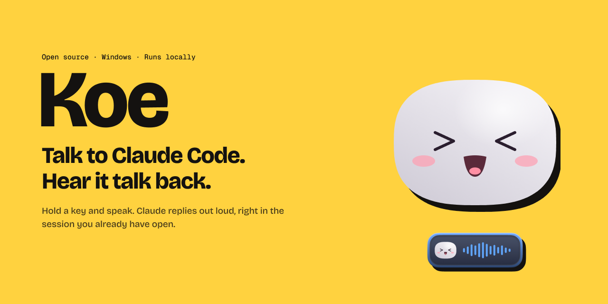
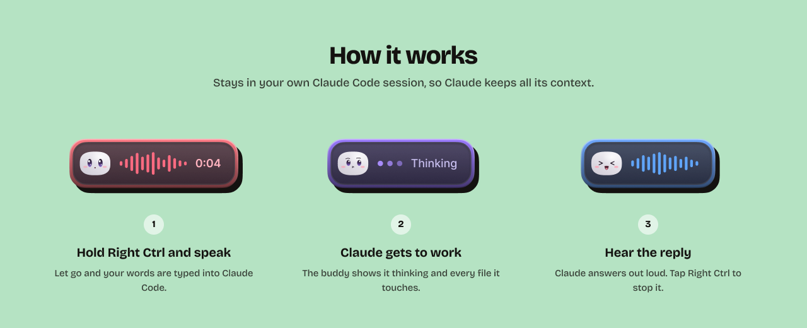
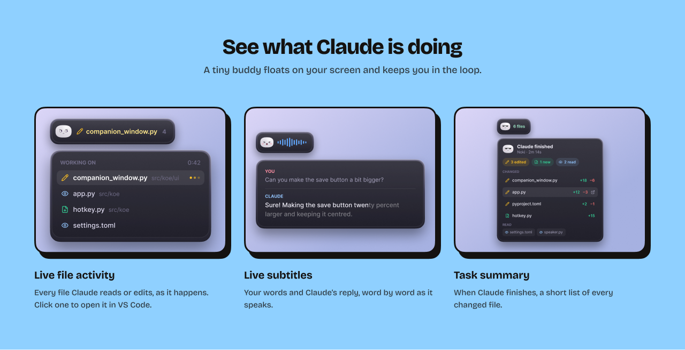

<p align="center">
  
</p>

<p align="center">
  <b>Talk to Claude Code on Windows. Hold a key, speak, and hear Claude talk back.</b><br>
  Everything runs on your own computer. Free and open source.
</p>

<p align="center">
  <a href="#install">Install</a> ·
  <a href="#how-to-use">How to use</a> ·
  <a href="#develop">Develop</a> ·
  <a href="#how-it-works-inside">How it works</a> ·
  <a href="#faq">FAQ</a>
</p>

---

## What is Koe?

Koe (声, "voice" in Japanese) is a small floating buddy for [Claude Code](https://claude.com/claude-code).

- **Push to talk.** Hold Right Ctrl, say what you need, let go. Your words are typed into
  the Claude Code session you already have open, so Claude keeps all its context.
- **Claude talks back.** Replies are read aloud as they arrive, with live subtitles.
- **See what Claude is doing.** The buddy shows every file Claude reads or edits, live,
  and a summary when it is done. Click a file to open it in VS Code at the right line.
- **Private.** Speech recognition ([faster-whisper](https://github.com/SYSTRAN/faster-whisper))
  and the voice ([Kokoro](https://github.com/hexgrad/kokoro)) run locally on your GPU.
  Nothing is sent anywhere. An ElevenLabs voice is optional, with your own key.

<p align="center">
  
</p>

<p align="center">
  
</p>

## Requirements

| | |
|---|---|
| OS | Windows 10 or 11 |
| GPU | NVIDIA with 4 GB VRAM or more recommended. CPU works, just slower. |
| Disk | About 5 GB (PyTorch with CUDA, plus ~800 MB of voice models) |
| Claude Code | Installed and signed in, running in a terminal or VS Code |

Tools to build it:

- [uv](https://docs.astral.sh/uv/getting-started/installation/) (Python manager)
- [Node.js 20+](https://nodejs.org/)
- [Rust](https://rustup.rs/) with the
  [Visual Studio C++ Build Tools](https://visualstudio.microsoft.com/visual-cpp-build-tools/)
  ("Desktop development with C++")

## Install

1. Download `Koe-v0.1.0-windows-x64.zip` from the
   [latest release](https://github.com/white-box-io/koe/releases/latest).
2. Unzip it anywhere, for example `C:\Koe`. Keep the folder together.
3. Double-click `koe.exe`.

The first launch installs the voice engine (about 3 GB of Python and PyTorch, once) and
the speech models (about 800 MB, once). It can take 10 to 20 minutes depending on your
internet. After that Koe starts in seconds.

To start Koe with Windows, turn on **Settings → General → Start with Windows**.

### Build from source

If you prefer to build it yourself (about 10 minutes, mostly downloads):

```powershell
git clone https://github.com/white-box-io/koe.git
cd koe

# 1. Voice engine (Python, PyTorch with CUDA)
uv sync

# 2. The app
cd app
npm install
npx tauri build --no-bundle
```

This creates `app\src-tauri\target\release\koe.exe`. Keep the `koe` folder where it is:
a self-built `koe.exe` runs the voice engine from the repo's `.venv`.

To build the release zip yourself: `scripts\package-release.ps1`.

## How to use

1. Open Claude Code in a terminal or VS Code. Koe finds the active session by itself.
2. Click into the Claude Code input box.
3. **Hold Right Ctrl**, speak, and let go. Your words are pasted and sent.
4. Claude's reply is read aloud. **Tap Right Ctrl** to stop it.

| Do this | To |
|---|---|
| Hold Right Ctrl | Talk |
| Tap Right Ctrl while Claude speaks | Stop the voice |
| Hold Right Ctrl, then tap Right Shift | Cancel what you were saying |
| Click the buddy | Show file activity |
| Right-click the buddy | Menu: pause listening, stop speaking, follow session, voice, settings, quit |
| Hover the buddy | Quick buttons: pause listening, stop speaking, settings |
| Double-click the buddy | Poke it |
| Drag the buddy | Move it. It snaps to screen edges. |

### Settings

- **General:** talk key, which session to follow, speak replies on/off, subtitles,
  task-done alerts, start with Windows.
- **Hearing:** microphone and Whisper model. `small.en` is a good balance;
  `medium.en` is more accurate but needs more VRAM.
- **Voice:** 12 Kokoro voices and speed, or ElevenLabs with your own API key.

Settings are saved in `%APPDATA%\koe\settings.json`. Logs are in the same folder:
`engine.log` (voice engine) and `ui.log` (app errors).

### Backup panel

When Claude asks you to back up files before editing, it can list them in a
`koe-backup` block. Koe shows them in a panel instead of reading them aloud, with a
**Back up** button that copies them to `Backup/<date>/<time>/` in your project root.

````text
```koe-backup
C:/path/to/file1.php
C:/path/to/file2.js
```
````

## Develop

```powershell
uv sync
cd app
npm install
npx tauri dev
```

`npx tauri dev` hot-reloads the UI. Changes to the Rust core or the Python engine need a
restart of the command.

### Project layout

```text
koe/
├─ src/koe/engine/        Python voice engine (runs as a hidden child process)
│  ├─ engine.py           boot, commands, wiring
│  ├─ microphone.py       push to talk, recording, cancel
│  ├─ transcriber.py      faster-whisper
│  ├─ speaker.py          Kokoro (and ElevenLabs) playback, sentence by sentence
│  ├─ elevenlabs.py       optional ElevenLabs voice
│  ├─ focus.py            returns focus to Claude Code before pasting
│  └─ protocol.py         JSON lines over stdin/stdout
├─ app/src-tauri/src/     Rust core (Tauri 2)
│  ├─ engine.rs           starts and talks to the voice engine
│  ├─ transcript.rs       follows the Claude Code session file
│  ├─ settings.rs         settings.json
│  └─ lib.rs              commands for the UI
├─ app/src/               React + TypeScript + GSAP UI
│  ├─ components/buddy/   the animated character
│  ├─ components/widget/  the floating pill
│  ├─ panels/             activity, settings, setup, subtitles, errors, backup
│  └─ state/              reducer and app state
└─ scripts/               engine smoke test, autostart helper
```

### Checks

```powershell
cd app; npx tsc --noEmit                         # TypeScript
cd app/src-tauri; cargo test                     # Rust (transcript parsing)
uv run python scripts/check_engine.py            # voice engine boots and answers
npx vite build -c vite.preview.config.ts         # gallery of every screen (in app/)
```

The preview gallery (`app/dist-preview/preview.html`) renders every widget state and
panel with fake data, so you can check the UI without a microphone or GPU.

See [CONTRIBUTING.md](CONTRIBUTING.md) before opening a pull request.

## How it works inside

```text
 You speak ──▶ Python engine ──▶ Whisper ──▶ text pasted into Claude Code
                                                      │
                                                      ▼
 Koe speaks ◀── Kokoro ◀── Rust core ◀── Claude Code session file (~/.claude/projects)
                                │
                                └──▶ UI: file activity, subtitles, task summary
```

Koe never talks to Claude itself. It is the ears and mouth of the session you already
run: it types for you and reads Claude Code's own session file to hear the replies and
see which files are touched.

## FAQ

**Does it work with Codex, Cursor, or other tools?**
Not yet. Koe reads Claude Code's session files, so replies and file activity only work
with Claude Code.

**Is my voice sent to the cloud?**
No. Whisper and Kokoro run on your machine. Only if you choose ElevenLabs is reply text
sent to ElevenLabs.

**It typed into the wrong window.**
Koe returns focus to the last window you used before pasting. Click into Claude Code
once before you talk.

**macOS or Linux?**
Windows only for now. The talk key and window focus code use the Windows API.

## Credits

- [Kokoro](https://github.com/hexgrad/kokoro) by hexgrad (Apache 2.0)
- [faster-whisper](https://github.com/SYSTRAN/faster-whisper) by SYSTRAN (MIT)
- [Tauri](https://tauri.app/), [React](https://react.dev/), [GSAP](https://gsap.com/),
  [Lucide](https://lucide.dev/)

## License

[MIT](LICENSE) © 2026 Akash Debnath. Use it, change it, share it. Please keep the
copyright notice in copies and forks.

## Disclaimer

Koe is an independent open-source project. It is not affiliated with, endorsed by, or
sponsored by Anthropic. Claude and Claude Code are trademarks of Anthropic, PBC.
